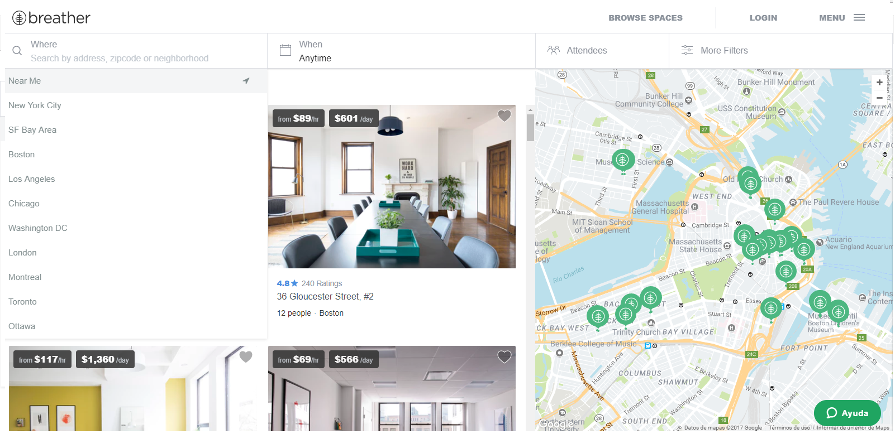
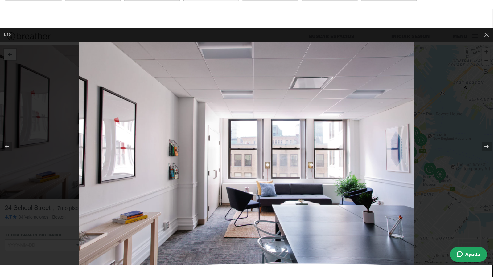

Identifica los elementos de navegación en los siguientes sites:

°Breather

-En este caso tenemos a Breather una pagina web que facilita las transacciones entre los consumidores y las personas que alquilan espacios habitables.
 La compañía se promociona a sí misma como una forma de encontrar un entorno para descansar fuera de su hogar u oficina.

-Se han encontrado los siguientes tipos de navegacion:

Navegacion localizada: la pagina tiene un buscador dentro de esta, en el cual podemos seleccionar las salas de reuniones de acuerdo al pais o ciudad en la cual nos encontremos.

Navegacion facetada: ya que una vez que seleccionamos el pais o ciudad nos sale una serie de filtros no editables de acuerdo a la busqueda que hemos realizado.

Navegacion inline: ya que cuando hacemos click en el boton que dice "ver plano" nos muestra la imagen del sitio que se desea rentar,no siendo este el unico link de referencia que muestra, esto hace mas interactiva la actividad que tiene el usuario con la pagina web.

